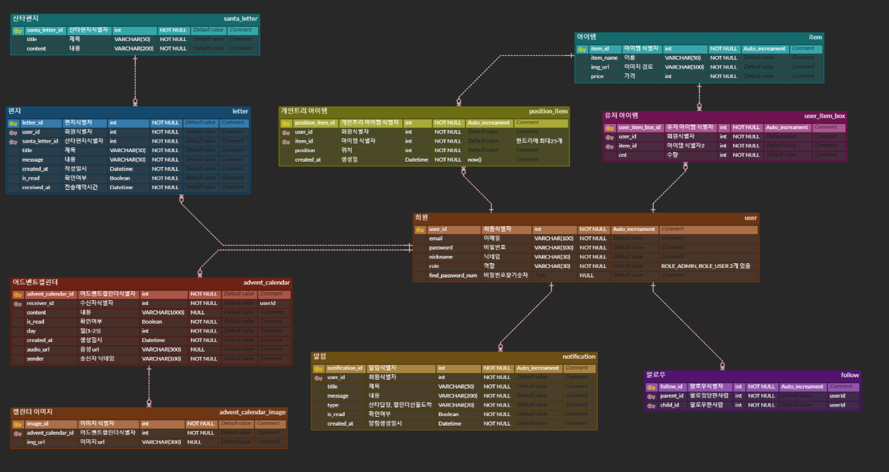

# :christmas_tree: SSANTA CLINIC 

## :newspaper: 1. PJT summary

- 팀명: 6T (미정)

- 프로젝트명: SSANTA CLINIC 
- 주제: 지친 ssafy 생들을 위로하는 크리스마스 분위기의 프로젝트

- 기간: 2022.10.11(화) ~ 2022.10.18(금)
- 발표: 2022.10.18(금)
- 조원: 김혜린, 강승길, 임완택, 엄윤규, [이동환](https://github.com/onghwand), 허성은
- 사용기술스택:
  - 협업, 버전관리: 
  - 언어:
  - 프레임워크:
  - DB:
  - 배포:    
  - 디자인:
  - 주요 기술: 

## 2. 팀원 소개

> 나중에 최종 ppt에 있는 장표 붙이기

## 3. 프로젝트 산출물

> 링크 걸기 or 아래 사진 붙여넣기

- 기능정의서
- 와이어프레임
- 컴포넌트다이어그램
- API
- ERD

- 기술스택
- UCC
- 아키텍쳐
- 포팅매뉴얼

## 4. 발표자료

> 링크 걸기

- 중간발표
- 최종발표

## 5. 서비스 화면

> gif로

### 회원가입

### 홈 화면

### 미니게임

### 편지

### 상점

